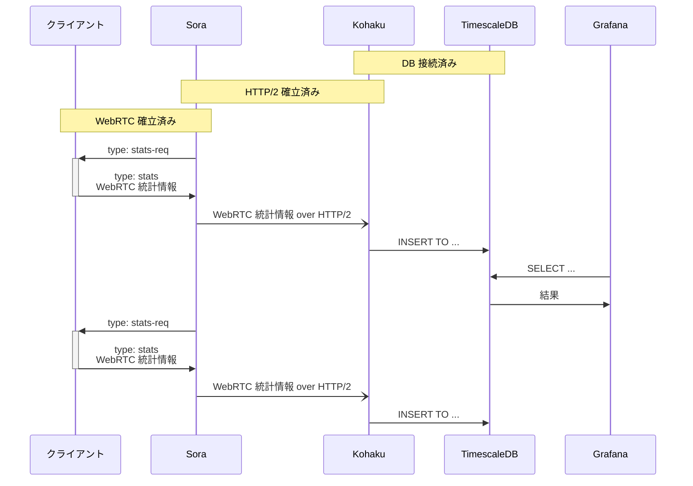

# WebRTC Stats Collector Kohaku

[](https://github.com/shiguredo/kohaku)
[](https://opensource.org/licenses/Apache-2.0)

## About Shiguredo's open source software

We will not respond to PRs or issues that have not been discussed on Discord. Also, Discord is only available in Japanese.

Please read https://github.com/shiguredo/oss/blob/master/README.en.md before use.

## 時雨堂のオープンソースソフトウェアについて

利用前に https://github.com/shiguredo/oss をお読みください。

## WebRTC Stats Collector Kohaku について

Kohaku はクライアントと Sora の統計情報を Sora から HTTP/2 経由で受け取り、整理してタイムシリーズデータベースに格納するゲートウェイです。
現時点ではタイムシリーズデータベースは TimescaleDB のみに対応しています。

## 特徴

- Sora から HTTP/2 経由でクライアントの統計情報を受け取り TimescaleDB (TSDB) に格納します
  - HTTPS 経由だけでなく HTTP 経由の h2c にも対応しています
- [WebRTC 統計 API](https://www.w3.org/TR/webrtc-stats/) に対応しています
  - ブラウザは最新 Chrome / Firefox / Safari / Edge へ対応
  - Sora SDK は iOS / Android / Unity / C++ / Python に対応
  - WebRTC Native Client Momo に対応
- クライアントは Sora に統計情報を送るだけでよくなるため、どこかのサーバに対して接続などが不要になります
- すべての統計情報を Sora の Channel ID と Connection ID と関連付けて保存するため問題の追跡がしやすくなります
- Grafana ダッシュボードを用意

## Grafana ダッシュボード

すぐに使い始められるように Grafana ダッシュボードを作り込んであります。
接続一覧からコネクション ID をクリックすると受信した音声や映像(`inbound-rtp`)の統計情報が確認できます。

[](https://gyazo.com/83860bc12e627682628a9b1e74efa2f1)

[](https://gyazo.com/1d80ade174fddd377506080b7902a7da)

## 使ってみる

Kohaku を使ってみたい人は [USE.md](https://github.com/shiguredo/kohaku/blob/develop/doc/USE.md) をお読みください。

## シーケンス



## ライセンス

Apache License 2.0

```
Copyright 2021-2023, Hiroshi Yoshida (Original Author)
Copyright 2021-2023, Shiguredo Inc.

Licensed under the Apache License, Version 2.0 (the "License");
you may not use this file except in compliance with the License.
You may obtain a copy of the License at

    http://www.apache.org/licenses/LICENSE-2.0

Unless required by applicable law or agreed to in writing, software
distributed under the License is distributed on an "AS IS" BASIS,
WITHOUT WARRANTIES OR CONDITIONS OF ANY KIND, either express or implied.
See the License for the specific language governing permissions and
limitations under the License.
```

## 優先実装

優先実装とは Sora のライセンスを契約頂いているお客様限定で Kohaku の実装予定機能を有償にて前倒しで実装することです。

### 優先実装が可能な機能一覧

**詳細は Discord やメールなどでお気軽にお問い合わせください**

- AWS Timestream 対応
- SQLite 対応

## 記事

- [\[備忘録\] WebRTC Stats Collector Kohaku を触ってみた](https://zenn.dev/adaniya/articles/1a06e22a23927b)
  - 一世代前の Kohaku のため、このままでは動作しません
  - 導入からグラフ化までを一通り試した良記事
